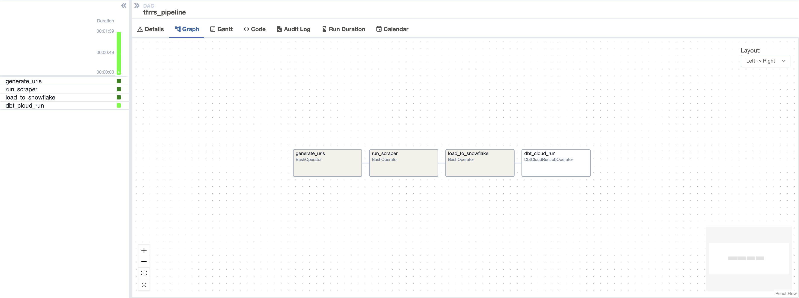
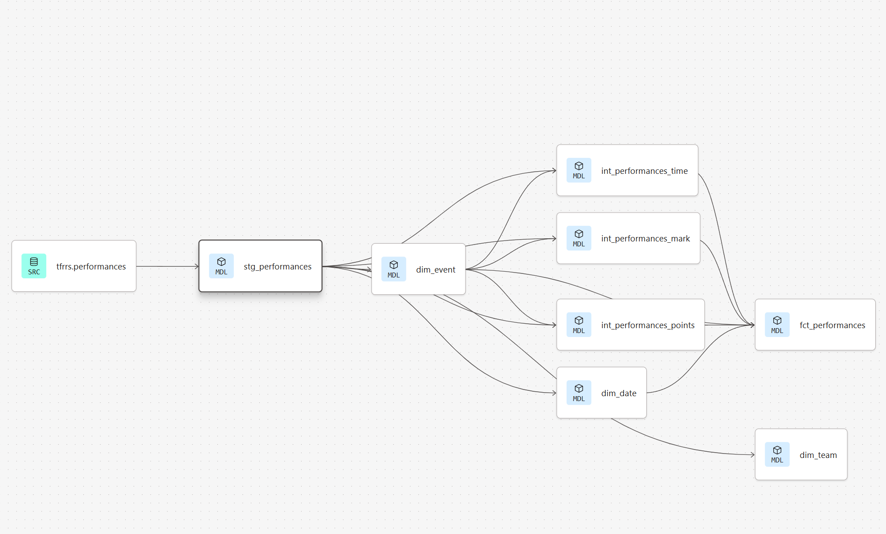

# tfrrs-dbt
A dbt project modeling 1.4M rows of NCAA and NAIA track & field 
performance data in Snowflake, sourced from [TFRRS](https://www.tfrrs.org/) 
across 4 divisions and 15 seasons via a 
[custom Python scraper](https://github.com/Jamar-Manning/tfrrs-scraper).

## Pipeline Orchestration

The full pipeline is orchestrated by an Airflow DAG (`tfrrs_pipeline`) that runs four tasks in sequence:

`generate_urls` → `run_scraper` → `load_to_snowflake` → `dbt_cloud_run`

dbt Cloud is triggered via `DbtCloudRunJobOperator` only after data has been scraped and loaded, ensuring models always run on validated data.

## Lineage

## Project Structure

### Staging
- `stg_performances` — cleans and standardizes raw scraped data from the TFRRS source table

### Intermediate
- `int_performances_time` — filters to time-based events (sprints, hurdles, mid distance, distance) and parses results into seconds
- `int_performances_mark` — filters to field events (throws, jumps) and parses results into meters
- `int_performances_points` — filters to combined events (heptathlon, decathlon, pentathlon) and parses results into points

### Marts
- `dim_event` — unique events with category classification
- `dim_date` — meet date attributes
- `dim_team` — unique teams
- `fct_performances` — Fact table joining all intermediate models with dimension attributes, including a typed `result_numeric` column and `result_type` indicator

## Tests
Schema tests validate `not_null` constraints on key columns across staging and intermediate models, and `accepted_values` on event categories.
